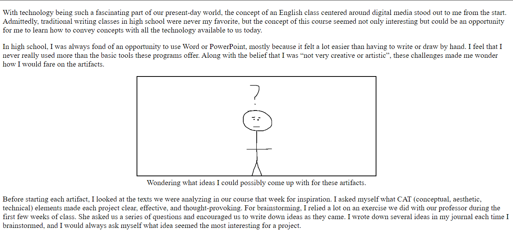
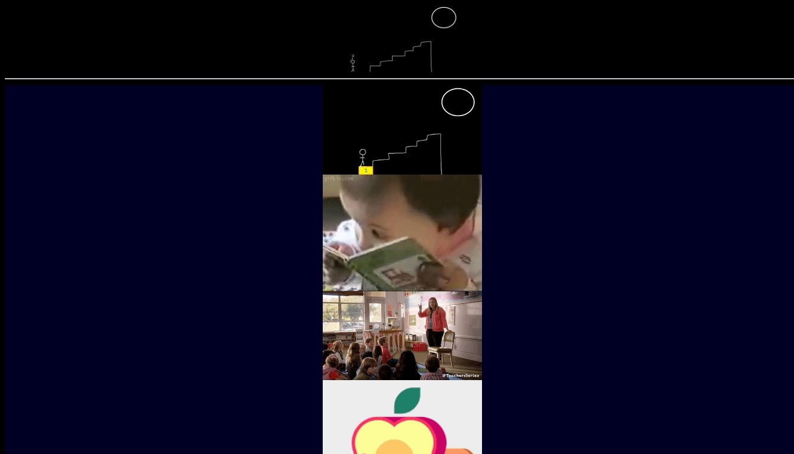
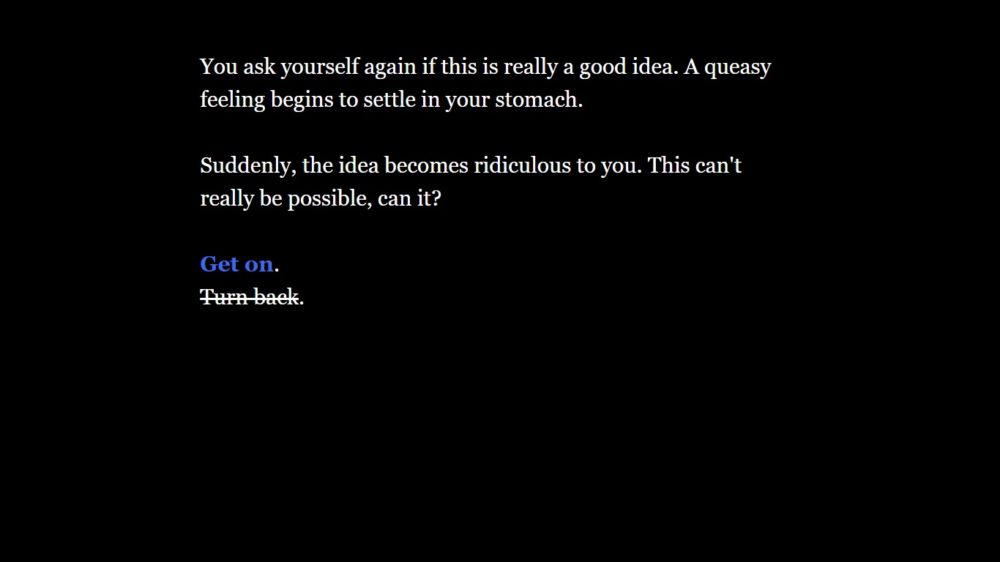
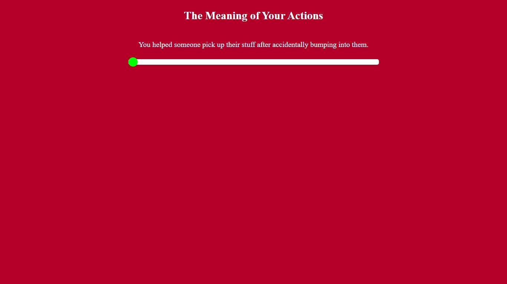

	

	<h2> Welcome to my page! </h2>
	
 This summer, I took English Composition II (or English 1102) at Georgia Tech. For this class, I created 3 projects, or artifacts, all with different elements and concepts. 

	
 For any questions, concerns, or comments, feel free to email me at <a href="adiaz86@gmail.com">adiaz86@gmail.com</a>. 

	

 

	<ul>
  		<li> <a href="Essay/reflective-essay.html">Introduction - Reflective Essay</a> </li>
		<li> <a href="Artifact-1/home.html">Artifact 1 - Our Forgotten Goal</a> </li>
  		<li> <a href="Artifact-2/La-Bestia.html">Artifact 2 - La Bestia</a> </li>
  		<li> <a href="Artifact-3/main.html">Artifact 3 - The Meaning of You</a> </li>
	</ul>

	<h2> Reflective Essay </h2>
	<figure>
		
		<figcaption> My process of creating these projects, from drafting and collaborating to revising and publishing. </figcaption>
	</figure>
	<button onclick="document.location='Essay/reflective-essay.html'">Go to essay</button>

	<h2> Our Forgotten Goal </h2>
	<figure>
		
		<figcaption> A story that shows how important education is. </figcaption>
	</figure>
	<button onclick="document.location='Artifact-1/home.html'">Go to artifact</button>

	<h2> <i> La Bestia </i> </h2>
	<figure>
		
		<figcaption> The story of an immigrant looking for a better life. </figcaption>
	</figure>
	<button onclick="document.location='Artifact-2/La-Bestia.html'">Go to artifact</button>

	<h2> The Meaning of You </h2>
	<figure>
		
		<figcaption> Don't worry, be happy. </figcaption>
	</figure>
	<button onclick="document.location='Artifact-3/main.html'">Go to artifact</button>

